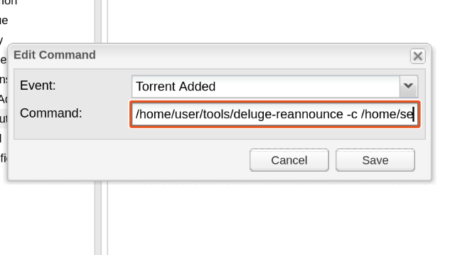

# Deluge Reannounce Tool

A command-line tool that forces a reannounce of a torrent in Deluge. This tool is designed to work with Deluge's Execute plugin, specifically with the "Torrent Added" event, to automatically reannounce torrents when they are added to Deluge.

## Features

- Forces reannounce of torrents in Deluge
- Configurable Deluge daemon connection settings
- File-based logging with different severity levels (INFO/DEBUG)
- Automatic retry mechanism for reannounce operations (7s interval, 120s timeout)
- Command-line flags to override config file settings
- Custom config file location support

## Prerequisites

- Deluge torrent client with daemon enabled
- Go 1.16 or later (for building from source)

## Installation

- Either download the pre-built binary or build from source

### Pre-built Binary

Download the latest release for your platform from the releases page.

### Building from Source

```bash
git clone https://github.com/korteke/deluge-reannounce.git
cd deluge-reannounce
CGO_ENABLED=0 GOOS=linux GOARCH=amd64 go build -ldflags="-w -s" -o deluge-reannounce
```

2. Place the executable in a location accessible by Deluge (e.g., `/home/user/tools/deluge-reannounce`)
3. Make the file executable:
```bash
chmod +x /home/user/tools/deluge-reannounce
```

4. Configure Deluge's Execute plugin:
   - Open Deluge preferences
   - Enable the Execute plugin
   - Add a new command for the "Torrent Added" event
   - Set the full path to the executable with the config file parameter, for example:
     `/home/user/tools/deluge-reannounce -c /home/user/tools/config.yml`

Example configuration in Deluge's Execute plugin:


## Configuration

Create a `config.yml` file in the same directory as the executable with the following structure:

```yaml
deluge:
  hostname: "127.0.0.1"
  port: 58846
  login: "localclient"
  password: "deluge"

logging:
  file: "deluge-reannounce.log"
  level: "INFO"  # Can be "INFO" or "DEBUG"

retry:
  timeout: 120   # Maximum time to wait for successful reannounce (in seconds)
  interval: 7    # Time between reannounce attempts (in seconds)
```

The configuration file supports the following sections:

1. **deluge**: Deluge daemon connection settings
   - `hostname`: Deluge daemon hostname
   - `port`: Deluge daemon port
   - `login`: Deluge daemon login
   - `password`: Deluge daemon password

2. **logging**: Logging configuration
   - `file`: Path to the log file
   - `level`: Logging level ("INFO" or "DEBUG")

3. **retry**: Reannounce retry settings
   - `timeout`: Maximum time to wait for successful reannounce (in seconds, default: 120)
   - `interval`: Time between reannounce attempts (in seconds, default: 7)

### Command-line Flags

- `-config`: Path to config file (default: "config.yml")
- `-host`: Deluge daemon host
- `-port`: Deluge daemon port
- `-username`: Deluge daemon username
- `-password`: Deluge daemon password

Example usage with custom config file:
```bash
./deluge-reannounce -config /home/user/tools/config.yml -username myuser -password mypass <torrent_id> <torrent_name> <download_folder>
```

## Usage

```bash
./deluge-reannounce [flags] <torrent_id> <torrent_name> <download_folder>
```

The `<torrent_id>` is the hash of the torrent you want to reannounce. This is typically a 40-character hexadecimal string.

## Logging

The tool provides two logging levels:

1. **INFO** (default):
   - Logs received requests with file names
   - Logs successful reannounce operations
   - Logs connection errors and failures

2. **DEBUG**:
   - Includes all INFO level logs
   - Logs all requests and responses from the Deluge daemon
   - Logs individual reannounce attempt failures
   - Provides detailed error information

## Compatibility

The program can be built for any platform that Go supports. The compatibility depends on which version you download or how you build it:

- **Pre-built binaries**: Check the releases page for available platforms
- **Building from source**: Can be built for any platform supported by Go (Windows, macOS, Linux, etc.)
- **Deluge requirement**: Deluge 2.0 or later with Execute plugin enabled


## Troubleshooting
You can check the operation of Deluge's Execute plugin with the bash script available from the [Deluge's official website](https://deluge-torrent.org/plugins/execute/). It can be used to ensure that the Execute plugin is started when a new file is added to the interface.   

Some installations do not allow direct invocation of this program, but require a bash wrapper script (e.g., deluge-wrapper.sh). It can be as simple as this

```bash
#!/bin/bash

torrentid=$1
torrentname=$2
torrentpath=$3

/home/user/tools/deluge-reannounce -config /home/user/tools/config.yml "$torrentid" "$torrentname" "$torrentpath"

```
Save the script to a directory on the server where the Deluge user has permissions, give the file execute permission and point Execute plugin to this script, instead of pointing directly to this program.

Make the file executable:
```bash
chmod +x /home/user/tools/deluge-wrapper.sh
```

## License

This project is licensed under the MIT License - see the LICENSE file for details. 